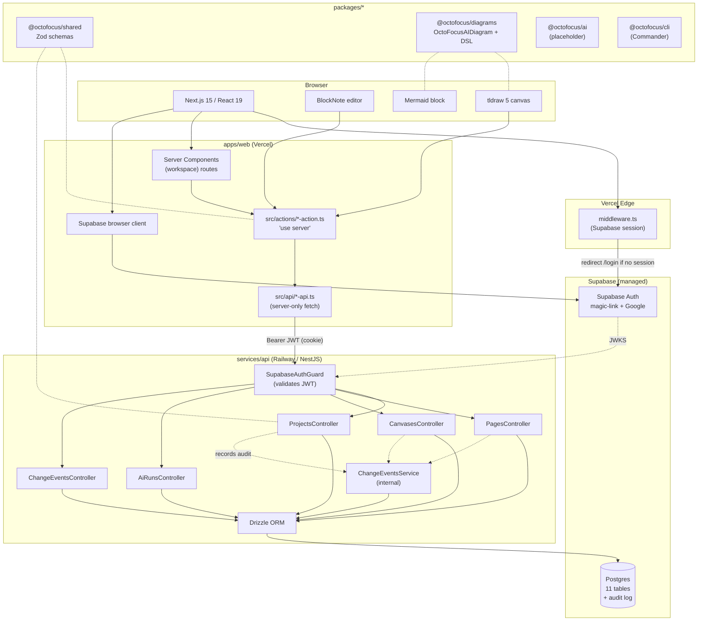

# OctoFocusAI Architecture

This document describes how the OctoFocusAI codebase is organized and how the pieces fit together at runtime.

## At a glance



## Monorepo layout

```
octo-focus-ai/
├── apps/web/                Next.js 15 + React 19  (Vercel)
├── services/api/            NestJS + Fastify       (Railway)
├── packages/
│   ├── shared/              Zod contracts + TS types
│   ├── diagrams/            OctoFocusAIDiagram schema + DSL parser
│   ├── ai/                  AI orchestration (stub)
│   └── cli/                 Commander CLI → backend API
├── docs/                    Plan + architecture
└── pnpm-workspace.yaml + turbo.json
```

Managed by **pnpm workspaces + Turborepo**. TypeScript everywhere. Each `@octofocus/*` package is consumed by the apps via pnpm symlinks; their `dist/` is rebuilt with a plain `tsc -p tsconfig.json` (the inherited path aliases are cleared so each emit stays self-contained).

## Frontend (`apps/web`)

Route layout follows the `CoderCouple/context0-next-frontend` reference: parenthesized route groups, colocated `_components/`, with `api/ → actions/ → components → page` as the data flow.

```
src/
├── app/
│   ├── (auth)/                          public routes
│   │   ├── _components/login-form.tsx
│   │   ├── login/page.tsx
│   │   ├── signup/page.tsx
│   │   ├── auth/callback/route.ts
│   │   └── layout.tsx
│   └── (workspace)/                     authenticated routes
│       ├── _components/projects-panel.tsx
│       ├── layout.tsx                   sidebar + topbar + SidebarProvider
│       ├── page.tsx                     workspace home
│       ├── projects/[id]/
│       │   ├── page.tsx                 RSC: auto-bootstraps page + canvas
│       │   └── _components/
│       │       ├── project-split-view.tsx    [Notes | Both | Canvas]
│       │       ├── notes-editor.tsx          dynamic ssr:false loader
│       │       ├── notes-editor-impl.tsx     BlockNote
│       │       └── mermaid-block.tsx         custom block
│       ├── canvas/
│       │   ├── page.tsx                      list (cards + table)
│       │   └── [id]/page.tsx + _components/  tldraw + DSL + auto-shape
│       └── notes/page.tsx                    list (cards + table)
├── api/                                  server-only HTTP wrappers
│   ├── server-client.ts                  fetch with cookie-derived JWT
│   ├── projects-api.ts
│   ├── pages-api.ts
│   ├── canvases-api.ts
│   └── me-api.ts
├── actions/                              'use server' wrappers
│   ├── projects-action.ts
│   ├── pages-action.ts
│   └── canvases-action.ts
├── components/
│   ├── ui/                               shadcn primitives
│   ├── app-sidebar.tsx + nav-* + team-switcher + nav-user   (sidebar-07)
│   ├── canvas-pane.tsx                   Auto-shape + DSL toolbar
│   ├── notes-pane.tsx                    Raw toggle toolbar
│   └── data-table.tsx + section-cards.tsx   (dashboard-01)
├── lib/
│   ├── supabase/{browser,server,middleware}.ts
│   ├── env.ts
│   └── utils.ts                          cn()
├── providers/query-provider.tsx          TanStack Query
└── middleware.ts                         Supabase session + auth gate
```

### Key UX components

- **`ProjectSplitView`** — Eraser-style split. Top toolbar with `[Notes | Both | Canvas]` toggle, default Both.
- **`NotesPane`** — Wraps BlockNote with a slim toolbar. Includes a **Raw** toggle that runs `blocksToMarkdownLossy` live against the current editor state and displays it in a `<pre>`.
- **`CanvasPane`** — Wraps tldraw with a slim toolbar containing **Auto-shape** (pencil → clean geo shape classifier) and **Diagram as code** (collapsible DSL textarea).
- **`MermaidBlock`** — Custom BlockNote block with source/render/fullscreen modes, three resizable handles (right edge, bottom edge, corner), hidden until hover. Defines `toExternalHTML` so markdown export emits a `\`\`\`mermaid` fence.

### Stack

Next.js · React 19 · Tailwind v4 · shadcn (sidebar-07, login-03, dashboard-01) · BlockNote (Notion-style block editor) · tldraw 5 · TanStack Query · Zustand · `@supabase/ssr`.

## Backend (`services/api`)

```
src/
├── main.ts                           bootstraps Nest + Fastify + loadEnvFile
├── modules/app.module.ts             wires controllers + services
├── auth/
│   ├── auth.module.ts                Global Supabase client provider
│   ├── supabase-auth.guard.ts        JWT validation + DEV_AUTH_BYPASS seed
│   └── supabase.tokens.ts
├── db/
│   ├── database.module.ts            Global Drizzle provider
│   └── schema.ts                     11 tables + 4 enums
├── common/
│   ├── zod-validation.pipe.ts        generic ZodValidationPipe<T>
│   └── change-events.service.ts      reusable audit recorder
└── routes/
    ├── health.controller.ts
    ├── me.controller.ts              upserts user + bootstraps personal workspace
    ├── projects.controller.ts        CRUD + audit
    ├── pages.controller.ts           CRUD + content_md + audit
    ├── canvases.controller.ts        CRUD + diagramSchema + audit
    ├── ai-runs.controller.ts         list / create / get / patch with auto-completedAt
    └── change-events.controller.ts   read-only audit log
```

### Auth model

- Supabase Auth issues JWTs. The frontend attaches the user's access token as `Authorization: Bearer <token>` on every server-only fetch.
- `SupabaseAuthGuard` validates the token with `supabase.auth.getUser(token)`.
- Every controller method that mutates data does a **membership check** against `workspace_members` before touching the row. This is the "backend owns permissions" rule from the plan.
- `DEV_AUTH_BYPASS=true` in `.env` is for local dev only: it skips the JWT check and seeds a deterministic Dev user / workspace / project / canvas.

### Audit trail

Every project / page / canvas mutation calls `ChangeEventsService.record({ workspaceId, actorType, userId, entityType, entityId, action, before, after, patch })`. Rows land in `change_events`, queryable via `GET /workspaces/:id/change-events`. AI agent runs (when added) will record events with `actorType: "AGENT"`.

## Data model

11 tables in Supabase Postgres:

```
users  ─────┐
            ├──► workspace_members ─► workspaces
            │                            │
            │                            ├──► projects
            │                            │      ├──► pages          (content_md TEXT canonical)
            │                            │      │      └──► page_blocks
            │                            │      ├──► canvases       (document JSON + diagramSchema)
            │                            │      │      └──► canvas_snapshots
            │                            │      └──► page_canvas_links
            │                            ├──► agents
            │                            ├──► ai_runs
            │                            └──► change_events  ◄── every mutation
            └──── (audit actor)
```

Enums: `workspace_role`, `agent_status`, `ai_run_status`, `change_actor_type`.

### Notes content as canonical markdown

`pages.content_md` is the canonical text representation. BlockNote serializes via `blocksToMarkdownLossy` on every save; the frontend writes both `document` (BlockNote JSON cache) and `contentMd` (markdown source-of-truth) on every PATCH. This unblocks:

- The **Raw** view in the editor
- The future `/p/<slug>` public publish route (markdown render)
- AI prompts and exports (CLI, RAG, etc.)

**Custom BlockNote blocks must define `toExternalHTML`** — without it the rendered widget HTML leaks into the markdown export. The Mermaid block is the reference implementation.

## Runtime flows

1. **Login**
   Magic-link email or Google OAuth → `(auth)/auth/callback/route.ts` exchanges the code → `@supabase/ssr` sets cookies → middleware lets future requests through.

2. **Me bootstrap**
   First hit to `GET /me` upserts the user row, then creates a personal workspace + `OWNER` membership in a single Drizzle transaction.

3. **Open a project**
   RSC fetches the project, then lists pages and canvases. If either is empty (new project), it server-side creates `"Untitled"` and `"Untitled canvas"` before rendering. Returns the split view.

4. **Edit notes**
   `BlockNote.onChange` → 1.2s debounce → `blocksToMarkdownLossy(blocks)` → `updatePageAction(pageId, { document: { blocks }, contentMd })` → `PATCH /pages/:id` → Drizzle UPDATE → `ChangeEventsService.record('page.update', { before, after, patch })`.

5. **Edit canvas**
   tldraw store listener (`scope: "document", source: "user"`) → 1.2s debounce → `getSnapshot(editor.store)` → `updateCanvasAction(canvasId, { document })` → same audit pattern.

6. **DSL → canvas shapes**
   Textarea change → 500ms debounce → `parseDsl(text)` (from `@octofocus/diagrams`) → `syncDiagramToTldraw(editor, diagram)` creates rectangles + arrow-bound edges with `meta.octoDsl=true` so they can be re-synced cleanly. The DSL text is persisted in `canvases.diagramSchema.dsl`.

7. **Auto-shape**
   `editor.sideEffects.registerAfterCreateHandler("shape", ...)` listens for completed `draw` shapes → `detectShape(points)` runs (circle / rect / line classifier with RDP corner-counting) → if classified, replaces the freehand stroke with a clean geo shape. Lines whose endpoints fall within 50px of an existing geo shape auto-bind as arrows.

8. **Mermaid block**
   Custom BlockNote block, `mermaid.render()` inside `useEffect`. `toExternalHTML` emits a `\`\`\`mermaid` fenced block so the markdown export and Raw view show the source code, not the rendered SVG.

9. **AI runs (placeholder)**
   `POST /ai-runs` records a `PENDING` run; `PATCH /ai-runs/:id` transitions through `RUNNING → SUCCEEDED|FAILED|CANCELLED` and auto-sets `completedAt` on terminal status. The AI integration (`@octofocus/ai`) will use this once the model call is wired.

## Deploy targets

| Layer | Host | Why |
|---|---|---|
| `apps/web` | **Vercel** | Native Next.js host with Edge middleware + RSC + Server Actions. |
| `services/api` | **Railway** (Fly.io / Render also work) | NestJS needs a long-running Node process. Vercel serverless doesn't fit. |
| Postgres + Auth | **Supabase** (managed) | Already live. |

### Required env vars

**`apps/web` (Vercel):**
```
NEXT_PUBLIC_SUPABASE_URL
NEXT_PUBLIC_SUPABASE_ANON_KEY
NEXT_PUBLIC_API_URL                # points at the Railway URL
```

**`services/api` (Railway):**
```
DATABASE_URL                       # Supabase session pooler URI (NOT direct host — that's IPv6 only)
SUPABASE_URL
SUPABASE_SERVICE_ROLE_KEY
WEB_ORIGIN                         # Vercel domain for CORS
PORT                               # Railway provides
```

`DEV_AUTH_BYPASS` is **never set in prod**. Local dev only.

### Supabase config (one-time)

After deploy, in Supabase dashboard → **Authentication → URL Configuration**:
- **Site URL**: the Vercel domain
- **Redirect URLs**: add `https://<your-vercel-domain>/auth/callback`

## Architectural rules (from the plan, enforced by code)

- **Separate frontend and backend.** Frontend never talks to Postgres directly; it goes through the API.
- **Backend owns AI calls.** `OPENAI_API_KEY` only lives on the backend.
- **Backend owns permissions.** Every controller checks workspace membership.
- **Supabase owns auth.** Backend just verifies the JWT.
- **Shared Zod contracts.** All API payloads use schemas from `@octofocus/shared`.
- **AI edits are auditable.** `ChangeEventsService` records before/after/patch on every mutation. Agent flows will use the same path with `actorType: "AGENT"`.
- **Canvas stores both states.** `document` (tldraw native) and `diagramSchema.dsl` (semantic) are persisted side-by-side.
- **Notes have a canonical markdown form.** `content_md` is updated on every save so Raw view, public publish, and AI prompts all see the same text.

## Non-goals (parking lot)

- Multi-page nesting per project (Notion-style trees). MVP is one main page + one main canvas per project, Eraser-style.
- Real-time multi-user cursors. Deferred until post-MVP.
- Workspace-only visibility for publishing. MVP starts with unlisted (URL-as-secret) only.
- Custom slug for public URLs. Auto-generated only.
- Round-trip DSL ↔ canvas (canvas edits back to DSL text). Current direction is text → canvas only.
