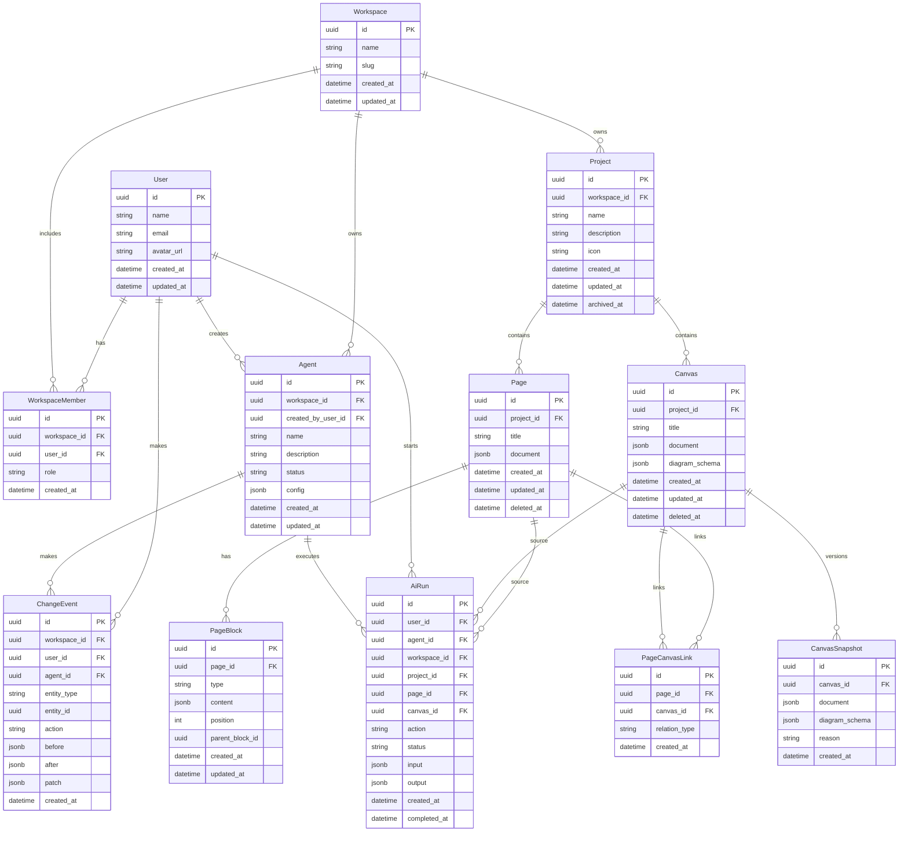

# OctoFocusAI MVP Technical Plan

## Product Direction

OctoFocusAI is a visual workspace for notes, canvases, diagram-as-code, human drawing, and AI agents.

The core MVP behavior:

> Users write notes, turn them into editable diagrams, and let AI agents safely update workspace content.

OctoFocusAI should feel like a focused blend of Notion, Eraser, and a developer-native AI workspace.

## Reference Repos

We will use these repositories as references, not direct forks:

- `CoderCouple/context0-next-frontend`
  - Next.js App Router structure
  - `src/app` route groups
  - shadcn/Radix component conventions
  - API client modules
  - hooks, stores, schemas, types
  - env validation and quality tooling
- `CoderCouple/octonote`
  - monorepo package boundaries
  - note/block/project domain model
  - AI package separation
  - server/core package split
  - tldraw-style drawing storage
  - CLI and developer-native workflow direction

## Stack

### Monorepo

- pnpm workspaces
- Turborepo
- TypeScript everywhere

### Frontend

- Next.js
- React
- Tailwind CSS
- shadcn/ui style primitives
- Tiptap for notes
- tldraw for canvas
- TanStack Query for server state
- Zustand for local workspace/canvas state

### Backend

- NestJS
- Drizzle ORM
- PostgreSQL
- Supabase Postgres
- Supabase Auth
- Zod schemas shared with frontend
- OpenAI API integration from backend only

### CLI

- TypeScript
- Commander
- Zod
- Talks to backend API only
- No direct database access

## Repository Shape

```txt
apps/
  web/                Next.js frontend

services/
  api/                NestJS backend API

packages/
  shared/             shared Zod schemas, DTOs, API contracts
  diagrams/           OctoFocusAI diagram schema and converters
  ai/                 prompts and AI orchestration
  cli/                developer CLI

docs/
  OCTOFOCUSAI_MVP_PLAN.md
```

## Backend ERD



## Data Model Rules

### Notes

- `Page.document` stores the full editor document snapshot.
- `PageBlock` supports block-level AI, ordering, search, and future references.
- Blocks use JSON content to keep the editor flexible.

### Canvas

- `Canvas.document` stores the editable tldraw snapshot.
- `Canvas.diagramSchema` stores OctoFocusAI's normalized diagram-as-code representation.
- `CanvasSnapshot` records major manual and AI mutations.

### AI Agents

AI agents are first-class workspace actors.

Agents must not mutate data invisibly. Every agent edit goes through backend actions that:

1. Validate permissions.
2. Produce a typed patch.
3. Create snapshots when needed.
4. Apply the mutation.
5. Record a `ChangeEvent`.

Risky actions can require user approval later.

### AI Runs

Every AI action is tracked through `AiRun`:

- note summarization
- note rewrite
- note-to-diagram generation
- prompt-to-canvas generation
- canvas layout improvement
- diagram-to-doc generation
- autonomous agent actions

## Diagram Architecture

AI should generate OctoFocusAI's normalized schema, not raw tldraw state.

```txt
Note text or prompt
  -> AI action
  -> OctoFocusAIDiagram schema
  -> converter
  -> tldraw editable canvas
```

This protects the product from being locked into a single renderer and keeps diagram-as-code viable.

## CLI Direction

The CLI is a first-class product surface for developers and agents.

Initial commands:

```txt
octofocus login
octofocus project list
octofocus page push
octofocus page pull
octofocus diagram generate
octofocus agent run
octofocus agent status
```

The CLI talks only to the backend API.

## MVP Build Order

1. Monorepo scaffold.
2. Prisma data model and migrations.
3. NestJS health endpoint and module structure.
4. Shared Zod contracts.
5. Diagram schema package.
6. Minimal Next.js workspace shell.
7. Project/page/canvas CRUD.
8. Tiptap note editor.
9. tldraw canvas.
10. Mock note-to-diagram generation.
11. OpenAI-backed diagram generation.
12. Agent edit proposal and change event flow.
13. CLI login and basic workspace commands.

## Non-Negotiables

- Separate frontend and backend.
- Backend owns AI calls.
- Backend owns permissions.
- Supabase owns authentication and managed Postgres.
- Backend verifies Supabase JWTs and enforces workspace authorization.
- Shared contracts for API payloads.
- AI edits are auditable.
- Canvas stores both human-editable state and semantic diagram state.
- Product quality is not sacrificed for short-term infrastructure savings.
